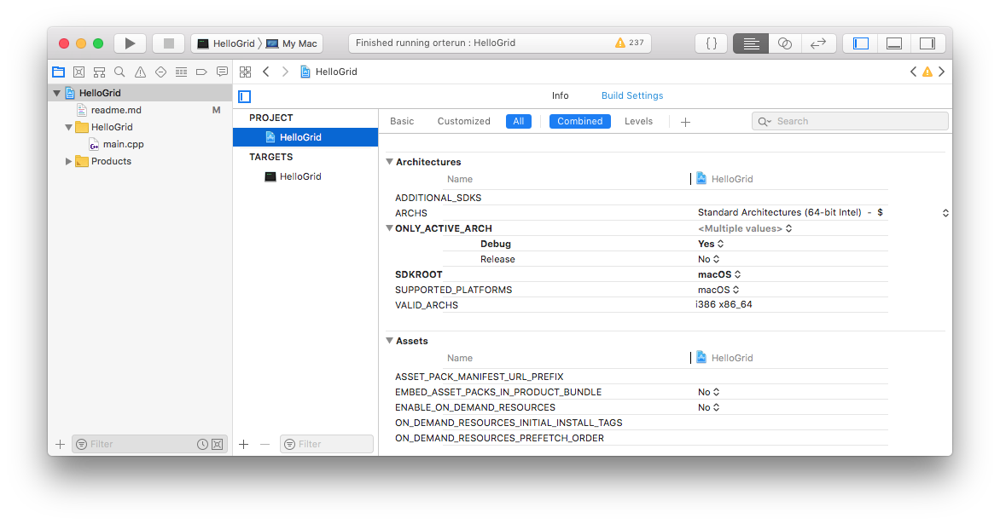
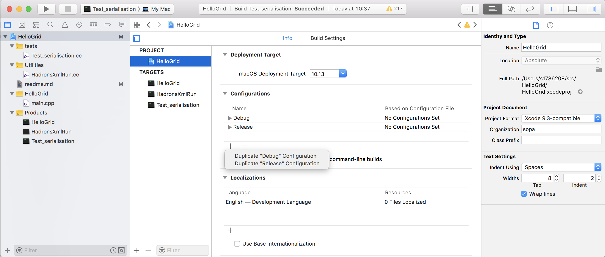
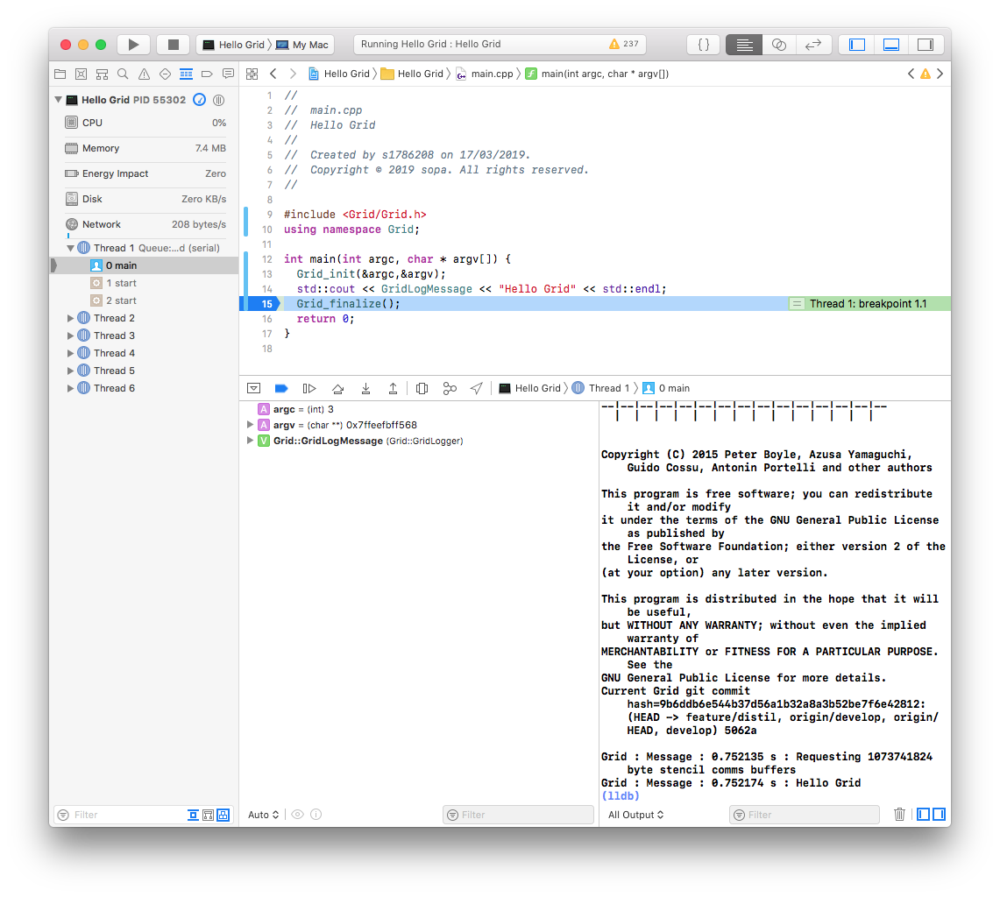
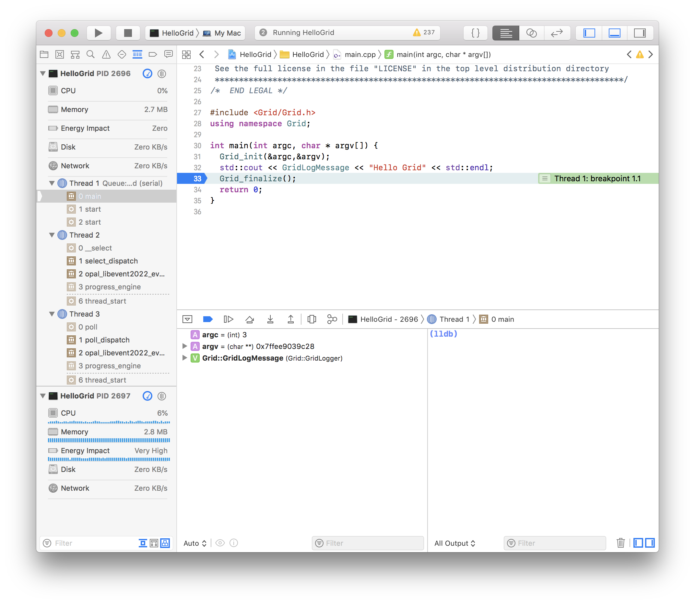

# Using Xcode for Grid on Mac OS

This guide explains how to use Xcode as an IDE for Grid on Mac OS.

*NB: this guide, and the screenshots, were generated using Xcode 10.1.*

# Initial setup

For first time setup of the Xcode and Grid build environment on Mac OS, you will need to do the following, in this order:

1. Install Xcode and the Xcode command-line utilities
2. Set Grid environment variables
3. Install and build Open MPI ***optional***
4. Install and build Grid pre-requisites
5. Install, Configure and Build Grid

Apple's [Xcode website][Xcode] is the go-to reference for 1, and the definitive reference for 4 and 5 is the [Grid Documentation][GridDoc].

[Xcode]: https://developer.apple.com/xcode/
[GridDoc]: https://github.com/paboyle/Grid/blob/develop/documentation/Grid.pdf

The following sections explain these steps in more detail

## 1. Install Xcode and the Xcode command-line utilities

See Apple's [Xcode website][Xcode] for instructions on installing Xcode.

Once Xcode is installed, install the Xcode command-line utilities using:

    xcode-select --install

## 2. Set Grid environment variables

To make sure we can share Xcode projects via git and have them work without requiring modification, we will define Grid environment variables. To make sure these environment variables will be available to the Xcode build system, issue the following shell command:

    defaults write com.apple.dt.Xcode UseSanitizedBuildSystemEnvironment -bool NO

These are the environment variables we will define for Grid:

Variable | Typical Value | Use
--- | --- | ---
`Grid` | `$HOME/src/Grid` | Path to grid source
`GridPre` | `$HOME/.local` | Path to install directory containing grid pre-requisites built from source
`GridPkg` | **MacPorts**=`/opt/local`, **Homebrew**=`/usr/local` | Path to package manager install directory

Choose either of the following ways to do this, and when you're done, log out and in again. To check these have been set:

    printenv|grep -i grid

### Method 1 -- Apple Script

* Start *Script Editor* (cmd-space, *script editor*)
* Click on *New Document*. Paste the following into the new script, editing the paths appropriately (just replace `user_id` with your *user_id* if you are unsure):

```apple script
do shell script "launchctl setenv Grid $HOME/src/Grid
launchctl setenv GridPre $HOME/.local
launchctl setenv GridPkg /opt/local"
```

* Save the script inside `~/Applications` and give it the name `GridEnv.app`.
* Open `System Preferences`, `Users & Groups`
* Click on `Login Items`
* Click the plus sign to add a new login item
* Select the `~/Applications` folder and select `GridEnv.app`

Log out and in again.

### Method 2 -- `environment.plist`

Make the file `environment.plist` in `~/Library/LaunchAgents` with the following contents, editing the paths appropriately (just replace `user_id` with your *user_id* if you are unsure):

```html
<?xml version="1.0" encoding="UTF-8"?>
<!DOCTYPE plist PUBLIC "-//Apple//DTD PLIST 1.0//EN" "http://www.apple.com/DTDs/PropertyList-1.0.dtd">
<plist version="1.0">
<dict>
<key>Label</key>
<string>Grid.startup</string>
<key>ProgramArguments</key>
<array>
<string>sh</string>
<string>-c</string>
<string>launchctl setenv Grid $HOME/src/Grid
launchctl setenv GridPre $HOME/.local
launchctl setenv GridPkg /opt/local</string>

</array>
<key>RunAtLoad</key>
<true/>
</dict>
</plist>
```

## 3. Install and build Open MPI -- ***optional***

Download the latest version of [Open MPI][OMPI] version 3.1 (I used 3.1.5) and build it like so:

[OMPI]: https://www.open-mpi.org/software/ompi/v3.1/

    ../configure CC=clang CXX=clang++ CXXFLAGS=-g --prefix=$GridPre/bin
    make -j 4 all install

***Note the `/bin` at the end of the prefix - this is required. As a quirk of the OpenMPI installer, `--prefix` must point to the `bin` subdirectory, with other files installed in `$GridPre/include`, `$GridPre/lib`, `$GridPre/share`, etc.***

Grid does not have any dependencies on fortran, however many standard scientific packages do, so you may wish to download GNU fortran (e.g. MacPorts ``gfortran`` package) and add the following to your configure invocation:

    F77=gfortran FC=gfortran

## 4. Install and build Grid pre-requisites

To simplify the installation of **Grid pre-requisites**, you can use your favourite package manager, e.g.:

### 1. [MacPorts][MacPorts]

[MacPorts]: https://www.macports.org "MacPorts package manager"

Install [MacPorts][MacPorts] if you haven't done so already, and then install packages with:

    sudo port install <portname>

These are the `portname`s for mandatory Grid libraries:

* git-flow-avh
* gmp
* hdf5
* mpfr

and these are the `portname`s for optional Grid libraries:

* fftw-3-single
* lapack
* doxygen
* OpenBLAS

***Please update this list with any packages I've missed! ... and double-check whether OpenBLAS is really for Grid. NB: lapack doesn't seem to work. Should it be scalapack?***

### 2. [Homebrew][Homebrew]

[Homebrew]: https://brew.sh "Homebrew package manager"

Install [Homebrew][Homebrew] if you haven't done so already, and then install packages with:

    sudo brew install <packagename>

The same packages are available as from MacPorts.

### Install LIME ***optional***

There isn't currently a port for [C-LIME][C-LIME], so download the source and then build it:

[C-LIME]: https://usqcd-software.github.io/c-lime/ "C-language API for Lattice QCD Interchange Message Encapsulation / Large Internet Message Encapsulation"

    ../configure CC=clang --prefix=$GridPre
    make -j 4 all install

## 5. Install, Configure and Build Grid

### 5.1 Install Grid

[Grid]: https://github.com/paboyle/Grid

Start by cloning [Grid (from GitHub)][Grid] ***into the directory you specified in***  `$Grid`. Bear in mind that git will create the `Grid` subdirectory to place Grid in, so for example if `$Grid` is set to `~/src/Grid` then install Grid with:

    cd ~/src

followed by either:

    git clone git@github.com:paboyle/Grid.git

or

    git clone https://github.com/paboyle/Grid.git

depending on how many times you like to enter your password.

### 5.2 Configure Grid

The Xcode build system supports multiple configurations for each project, by default: `Debug` and `Release`, but more configurations can be defined. We will create separate Grid build directories for each configuration, using the Grid **Autoconf** build system to make each configuration. NB: it is **not** necessary to run `make install` on them once they are built (IDE features such as *jump to definition* will work better of you don't).

Below are shown the `configure` script invocations for three recommended configurations. You are free to define more, fewer or different configurations, but as a minimum, be sure to build a `Debug` configuration.

#### 1. `Debug`

This is the build for every day developing and debugging with Xcode. It uses the Xcode clang c++ compiler, without MPI, and defaults to double-precision. Xcode builds the `Debug` configuration with debug symbols for full debugging:

    ../configure CXX=clang++ CXXFLAGS="-I$GridPkg/include/libomp -Xpreprocessor -fopenmp -std=c++11" LDFLAGS="-L$GridPkg/lib/libomp" LIBS="-lomp" --with-hdf5=$GridPkg --with-gmp=$GridPkg --with-mpfr=$GridPkg --with-fftw=$GridPkg --with-lime=$GridPre --enable-simd=GEN --enable-comms=none --enable-precision=double --prefix=$GridPre/Debug

#### 2. `Release`

Since Grid itself doesn't really have debug configurations, the release build is recommended to be the same as `Debug`, except using single-precision (handy for validation):

    ../configure CXX=clang++ CXXFLAGS="-I$GridPkg/include/libomp -Xpreprocessor -fopenmp -std=c++11" LDFLAGS="-L$GridPkg/lib/libomp" LIBS="-lomp" --with-hdf5=$GridPkg --with-gmp=$GridPkg --with-mpfr=$GridPkg --with-fftw=$GridPkg --with-lime=$GridPre --enable-simd=GEN --enable-comms=none --enable-precision=single --prefix=$GridPre/Release

#### 3. `MPIDebug`

Debug configuration with MPI:

    ../configure CXX=clang++ CXXFLAGS="-I$GridPkg/include/libomp -Xpreprocessor -fopenmp -std=c++11" LDFLAGS="-L$GridPkg/lib/libomp" LIBS="-lomp" --with-hdf5=$GridPkg --with-gmp=$GridPkg --with-mpfr=$GridPkg --with-fftw=$GridPkg --with-lime=$GridPre --enable-simd=GEN --enable-comms=mpi-auto MPICXX=$GridPre/bin/mpicxx --enable-precision=double --prefix=$GridPre/MPIDebug

### 5.3 Build Grid

Each configuration must be built before they can be used. You can either:

1.  Use automake and the Grid Makefile with `make -j 4` (NB: you **do not** need to run `make install` for these to work with Xcode)
2. Build `Grid` and `Hadrons` under Xcode (see below)

# Make a new application which links to Grid / Hadrons

Making an Xcode project which links to Grid / Hadrons is straightforward:

* Make a new application (in the usual way)
* Configure your application to use Grid (via three project settings:)
    1. `HEADER_SEARCH_PATHS`
    2. `LIBRARY_SEARCH_PATHS`
    3. `OTHER_LDFLAGS`
* Make additional configurations, e.g. `MPIDebug` (NB Xcode will make `Debug` and `Release` by default)

Detailed instructions follow, but instead of following the instructions in this section, you can clone `HelloGrid` from the [University of Edinburgh GitLab site][HelloGrid].

[HelloGrid]: https://git.ecdf.ed.ac.uk/s1786208/HelloGrid

## Make a new application

To make a hello world application for Grid:

* Start Xcode
* Click 'Create a new project'
* Click ‘macOS’, then in the ‘Application’ section choose ‘Command Line Tool’, then click ‘Next’
* Choose options for your new project:
  * Product Name: HelloGrid
  * Team: None
  * Organisation Name: sopa
  * Organisation Identifier: uk.ac.ed.ph
  * Language: C++
  * ... then click ‘Next’
* Choose a location for your project, e.g. `$HOME/src`. NB: The project and all it’s files will be created inside `$HOME/src/HelloGrid`. If you are using Git, you can put the new project under Git source control immediately, if you like. Now click ‘Create’.

## Configure your new application to use Grid

Click the project name (`HelloGrid`) in the project navigator pane on the left (command-1 if it's not visible), then click the project name (`HelloGrid`) under `PROJECT` in the second pane. Click the `Build Settings` tab on the right, then under that click `All` and `Combined`. You should see:



We now need to make changes to two sections (these are listed in alphabetical order), bearing in mind that if you are not using MPI (or you gave your build directories different names) replace `build_mpidebug` and `build_mpirelease` with the directory names you used.

### 1. Search Paths

#### HEADER_SEARCH_PATHS

Obtain a list of header locations required by Grid by running the following from your Grid build directory (choose an MPI configuration if you built one, e.g. `MPIDebug`):

    ./grid-config --cxxflags

Output should look similar to (but will likely include duplicates):

    -I$GridPre/include -I$GridPkg/include -O3 -g -std=c++11

The header locations follow the `-I` switches. You can ignore the other switches, and you can ignore duplicate entries, which just mean that your package manager has installed multiple packages in the same location.

*Note: `grid-config` will output absolute paths. Make sure to replace absolute paths with environment variables (such as `$GridPre`) in your settings, so that the project will work unmodified for other collaborators downloading the same project from git.*

Set HEADER_SEARCH_PATHS to:

    $Grid/build$(CONFIGURATION)/Grid
    $Grid

followed by (***the order is important***) the locations reported by `grid-config --cxxflags`, ignoring duplicates, e.g.:

    $GridPre/include
    $GridPkg/include
    
**Note: the easiest way to set this value is to put it all on one line, space separated, and edit the text to the right of `HEADER_SEARCH_PATHS`**, i.e.:

    $Grid/build$(CONFIGURATION)/Grid $Grid $GridPre/include $GridPkg/include

#### LIBRARY_SEARCH_PATHS

Obtain a list of library locations required by Grid by running the following from your Grid build directory (again, choose an MPI configuration if you built one, e.g. `MPIDebug`):

    ./grid-config --ldflags

Output should look similar to (but will likely include duplicates):

    -L$GridPre/lib -L$GridPkg/lib

Paste the output ***with `$Grid/build$(CONFIGURATION)/Grid $Grid/build$(CONFIGURATION)/Hadrons ` prepended*** into `LIBRARY_SEARCH_PATHS`:

    $Grid/build$(CONFIGURATION)/Grid $Grid/build$(CONFIGURATION)/Hadrons $GridPre/lib $GridPkg/lib

### 2. Linking

#### OTHER_LDFLAGS

The easiest way to link to all required libraries is to obtain a list of all libraries required by Grid by running the following from your Grid build directory:

    ./grid-config --libs

and pasting the output ***with `-lGrid -lHadrons ` prepended*** (including the `-l` switches) directly into `OTHER_LDFLAGS`, e.g.:

    -lGrid -lHadrons -lmpi -lhdf5_cpp -lhdf5 -lz -lcrypto -llime -lfftw3f -lfftw3 -lmpfr -lgmp -lm

## Make additional configurations

On the project settings, `Info` tab, click the plus sign underneath configurations:



Choose `Duplicate "Debug" Configuration` (you can choose `Release` if you prefer) and give the new configuration a name, e.g. `MPIDebug`.

## Edit your source code

A hello world for grid is:

```c++
#include <Grid/Grid.h>
using namespace Grid;

int main(int argc, char * argv[]) {
  Grid_init(&argc,&argv);
  std::cout << GridLogMessage << "Hello Grid" << std::endl;
  Grid_finalize();
  return 0;
}
```

## Create a `.gitignore` file for Xcode

You can create an up-to-date .gitignore file to ignore all the Xcode temporary build files using [gitignore.io][GIO].

[GIO]: https://www.gitignore.io/api/xcode

NB: If you let Xcode add your project to git when you created it, you probably want to remove your personal scheme selection from git:

    git rm --cached HelloGrid.xcodeproj/xcuserdata/$USER.xcuserdatad/xcschemes/xcschememanagement.plist

## Run your program under the Xcode debugger

First, specify command-line arguments. From the menu, select `Product`, then `Scheme`, then `Edit Scheme`. Select `Run` on the left, then select the `Arguments` tab on the right. Add the following to `Arguments passed on Launch`:

    --grid 4.4.4.8

If your program will be manipulating files, it's a good idea to specify the working directory on the `Options` tab under `Use Custom Working Directory` (by default, Xcode launches the program inside the Xcode build folder). 

Then click `Close`.

Let's set a breakpoint by clicking on:

    Grid_finalize();

then from the menu selecting `Debug`, then `Breakpoints`, then `Add Breakpoint at Current Line`.

Now click on the `Play` button (the right pointing triangle just to the right of the maximise button) to run your program under the debugger. (You may see dialog boxes the first couple of times asking whether to allow MPI to receive network requests - say yes to these.)

The debug output pane opens at the bottom of Xcode, with output on the right (ending with `Hello Grid`) and local variables on the left i.e.:



See the Xcode documentation to learn about the debugger. When you're done, press `ctl-cmd-Y` to let the program run to completion. 

# Debugging multiple MPI processes under Xcode

You could tell Xcode to use mpirun to launch multiple copies of a target executable, however if you do this the debugger will attach to mpirun - not your target process.

Instead:

1. Set a breakpoint just inside `main()` (otherwise your programs may complete before you attach to them all)

2. From the `Debug` menu, select `Attach to Process by PID or Name ...`.  In the `PID or Process Name` field, enter the name of your target. Then click `Attach`.

3. From a terminal session, locate and run your executable using `mpirun` (*the mangled name of the project build products will not be exactly the same as this example*):

    `$GridPre/bin/mpirun -np 2 ~/Library/Developer/Xcode/DerivedData/HelloGrid-fiyyuveptaqelbbvllomcgjyvghr/Build/Products/Debug/HelloGrid --grid 4.4.4.8 --mpi 1.1.1.2`

    The Xcode debugger will attach to the first process.

4. From the `Debug` menu in Xcode, select `Attach to Process`, and other running instances of your application will appear at the top of the list. Attach to as many instances as you wish to debug.

5. Click on the first process (which should have stopped at the breakpoint) and restart it with ctl-cmd-y

You are now debugging multiple MPI instances, and the Xcode debugger should look similar to this:   



# Build `Grid` and `Hadrons` libraries under Xcode

If you want to build `Grid` and `Hadrons` libraries using Xcode, you will need to:

1. Make new library targets for `Grid` and `Hadrons`

2. Add Grid source folders to your project:

    a. Right click project then `Add files to "project" ...`
    b. Choose `$Grid/Grid` folder
    c. Select `Create groups` (`folder references` doesn't work)
    d. Make sure none of the targets are selected
    e. Click `Add`
    f. Add each source file (not header) in `Grid` and its subdirectories to the `Grid` target (option-command-1, then tick source files)

3. Add Hadrons source folders to your project

    a. As per `Grid`, but add each source file in `Hadrons` (except those in `Archive` and `Utilities`) to the `Hadrons` target

4. Set the following values *for the entire project* in `Build Settings`

    Group | Variable | Value
    --- | --- | ---
    `Deployment` | `DSTROOT` | `$Grid/build$(CONFIGURATION)` *(do this for the entire project)*
    `Search Paths` | `LIBRARY_SEARCH_PATHS` | remove `$Grid/build$(CONFIGURATION)/Grid $Grid/build$(CONFIGURATION)/Hadrons` from the start of the path

    This sets the deployment location to the makefile build folders (but by default, targets will have `SKIP_INSTALL` set to `Yes`). The change to the paths is to make sure any executable targets link to the versions of the `Grid` and `Hadrons` libraries just built.  

5. Set the following values for each of the `Grid` and `Hadrons` targets in `Build Settings`

    Group | Variable | Value
    --- | --- | ---
    `Deployment` | `DEPLOYMENT_LOCATION` | `Yes`
    `Deployment` | `INSTALL_PATH` | `$(PRODUCT_NAME)/`
    `Deployment` | `SKIP_INSTALL` | `No`
    `Linking` | `OTHER_LDFLAGS` | remove `-lGrid -lHadrons` from the list
    
    This ensures that the libraries are copied back into the build folders when they are made (removing the need to run `make -j 4`)

6. For `Grid`, in `Build Settings` in the `Build Options` group, set:

    Variable | Configuration | Value
    --- | --- | ---
    `EXCLUDED_SOURCE_FILE_NAMES` | Non-MPI configurations (`Debug` and `Release`) | `$(Grid)/Grid/communicator/Communicator_mpi3.cc $(Grid)/Grid/communicator/SharedMemoryMPI.cc` 
    `EXCLUDED_SOURCE_FILE_NAMES` | MPI configurations (`MPIDebug`) | `$(Grid)/Grid/communicator/Communicator_none.cc $(Grid)/Grid/communicator/SharedMemoryNone.cc`

7. Make a new scheme called `Libraries` containing both `Grid` and `Hadrons` targets

    a. Edit the new scheme
    b. On the Build tab, add both `Grid` and `Hadrons` targets

You should now be able to build and debug any configuration.

Note that with this setup, the Xcode build system is not aware of dependencies of your targets on the grid libraries. So you can modify Grid and/or Hadrons headers if you need to, and build your target without rebuilding the entire Grid and Hadrons Libraries (you can manually force the Libraries to rebuild by making the `Libraries` scheme). You can instead configure target dependencies to `Grid` and `Hadrons` libraries in the Xcode build system, just remember to also remove `-lGrid -lHadrons` from the list under `OTHER_LDFLAGS` for the entire project.
